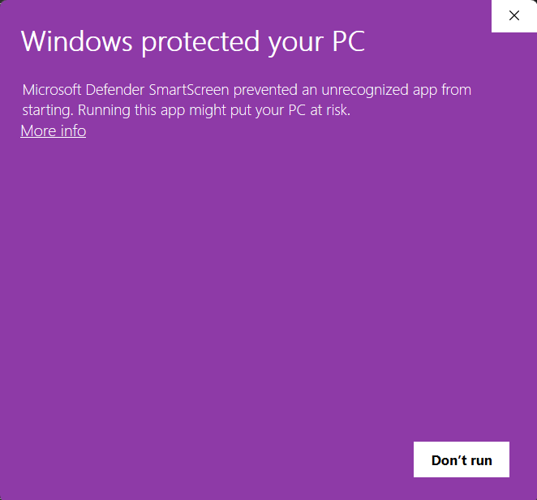
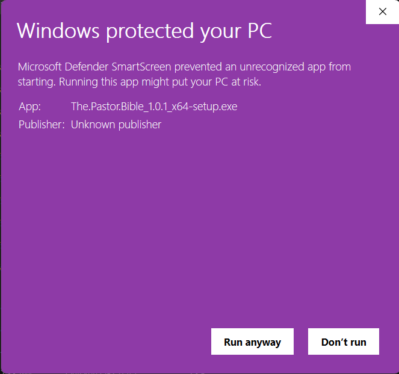

# The Pastor Bible

A free, offline, nondenominational Bible study tool with cited answers.

## Disclaimer

> The Pastor Bible is a study and educational tool. It searches the text of the Bible and summarizes what it finds, with citations. It is not a pastor, a counselor, or an authority, and its answers are not the final word on anything. Read the verses it cites for yourself. If you are struggling, please reach out to a real person.

## If you are in crisis

> If you are in crisis, or thinking about harming yourself or someone else, please reach out to a real person right now. In the United States, call or text 988. In other countries, call your local emergency number. Talk to a pastor, a counselor, or someone you trust. This app is a study tool and cannot help you the way a person can.

## What it is, and what it is not

> The Pastor Bible is nondenominational. It uses one public-domain translation and reports what the text says and where. It includes no commentary and takes no position on questions where Christian traditions differ. The optional Deuterocanon setting is provided because some traditions include those books and others do not; it is off by default and every passage from it is labeled.

## Install

Installers are published with each release. Download the one for your system
from the [releases page](https://github.com/haomuch1/pastor-bible/releases).
Each file there is labelled in plain words with what it is for; the labels are
what the page shows, and the filenames underneath them are what `SHA256SUMS.txt`
records.

> **The newest release is marked a pre-release.** Everything works and it is
> the build to install; the mark means one thing has not been done yet, which is
> to check a first install on a computer that has never had this program on it.
> Because it is a pre-release, GitHub does not put a "Latest" badge on it — take
> the topmost release on that page. The mark comes off once that check is made.

### Windows

1. On the releases page, take the file labelled **Windows installer — most
   people want this one**. It is `The.Pastor.Bible_<version>_x64-setup.exe`.
2. Run it.
3. **Windows will warn you.** See below.
4. It installs for you alone, into your own user folder, and asks for no
   administrator password.

> Because this is a free project made by volunteers, the installer is not yet signed with a paid certificate. When you run it, Windows will show a full-screen warning that says "Windows protected your PC." This is expected. Click "More info," then "Run anyway." We will apply for free open-source signing after the first release; when granted, the publisher shown will be "SignPath Foundation."

This is what it looks like. The warning names the file and says "Unknown
publisher", because nobody has paid to tell Windows who we are.

Click **More info** and the same screen grows a **Run anyway** button.

Nothing is put in `Program Files` and nothing is installed for other accounts on
the computer. If two people share a machine, each installs their own copy and
each keeps their own questions.

If your computer has never run a program that uses Microsoft's web view, the
installer fetches it from Microsoft and installs it without asking. That is the
one thing the installer downloads, it is about 2 MB, and most Windows 10 and 11
machines already have it.

### Linux

Take the file labelled **Linux installer for Ubuntu and Debian** (the `.deb`)
or **Linux portable app for any distribution** (the `.AppImage`).

    sudo apt install ./The.Pastor.Bible_<version>_amd64.deb

or make the AppImage executable and run it. The `.deb` needs
`libwebkit2gtk-4.1-0` and `libgtk-3-0`, which apt will pull in for you.

### Upgrading

Download the new installer and run it. That is all. It replaces the program, the
Bible index and the search model, and it leaves your questions and your
downloaded answering model exactly where they are. You will have one entry in
Add/Remove Programs, not two.

An older installer run over a newer installation stops and says so, and changes
nothing.

### Uninstalling

Uninstall from Add/Remove Programs, or run `uninstall.exe` in the install
folder. It removes the program and asks one question in plain words: whether to
delete your saved questions and the answering model you downloaded. **The
default is to keep them**, so that installing again later finds your questions
still there and does not have to download five gigabytes again.

## First run

The Pastor Bible arrives with the Bible index and the search model already in
it. One thing is downloaded, once: the answering model, about 4.7 GB. You are
shown the size before it starts, and it resumes if it is interrupted.

After the download it offers a check: three real questions, answered end to
end, so you can see it working before you trust it with your own. On the
machine below that check takes about **40 seconds** using the graphics card, or
about **7 minutes 30 seconds** on the processor. On a laptop that answers on its
processor, expect a few minutes; it has not stopped working.

Nothing else is ever downloaded. After the model is in place the program makes
no network connection at all.

## Hardware requirements

Built and tested on: AMD Ryzen 7 5800X (8 cores), NVIDIA RTX 3080 10 GB, 32 GB
RAM, Windows 11. Everything below was measured on that machine on 2026-08-26.

    disk           about 5.4 GB in all
    memory in use  about 9 GB for one answer on the processor, rising to about
                   12 GB over a long session of several questions; about 5.6 GB
                   of graphics memory instead when the graphics card is used
    an answer      about 6 seconds on the graphics card, and about 13 seconds
                   for the first question after the program opens, which
                   includes loading the model
                   about 2 to 3 minutes on the processor

The Pastor Bible will run on less than that. It will be slower, and on a
machine with much less memory it may swap and be slower still; it does not
refuse to start, and it does not check your hardware except to show you one
plain note on first run if something is below the machine above.

The 5.4 GB is everything: the program, the Bible index that ships with it, and
the answering model that downloads once on first run. The index and the search
model are about 630 MB of that and arrive with the installer. The answering
model is the rest, and it is the only thing downloaded afterwards.

Every install gets the same answering model, so every reader gets the same
answers. Settings offers a smaller one for machines that need it: it answers in
about half a minute instead of two and a half, needs about 2.7 GB of memory
instead of 9, and writes a plainer answer, usually one heading followed by the
passages in turn rather than several themes. Both cite only passages that were
actually found, and neither can invent a reference.

Everything happens on your own machine, with nothing sent anywhere, so the
hardware is the whole of the speed.

**A graphics card is worth more than anything else.** The ten questions used to
measure this project were answered in a median of 6.5 seconds each on the
graphics card above and 134 to 178 seconds on the processor. The Pastor Bible
uses the card by itself when the card has room for the model: the standard model
needs about 6.2 GB of free graphics memory and the smaller one about 2.9 GB.
Settings says which one is being used, names the card, and lets you insist on
either.

If there is no card, or the card is too small, or the card is busy with
something else, the processor answers instead and the program says so. Nothing
fails; it just takes minutes rather than seconds.

The timings above were measured on one machine, through the installed program
rather than a test harness. They will be checked on a clean machine before
release.

## Using it

Type a question in your own words and press **Ask**, or Ctrl+Enter. There is no
syntax to learn and there are no search operators: "What does the Bible say
about anger?" is the whole of it.

Two things then happen at different speeds. The passages appear almost at once,
because searching the index takes a fraction of a second, and you can start
reading them straight away. The written synopsis takes longer -- seconds on a
graphics card, minutes on a processor -- and it appears only after every
reference in it has been checked. **Stop** abandons a question that is taking
longer than you want to wait, and nothing is saved.

### The 66 books, and the Deuterocanon

Under the question box are two buttons: **66 books** and **Include
Deuterocanon**. The 66 books are always searched. The Deuterocanon is the set of
books that some Christian traditions include and others do not. It is off until
you turn it on, and it stays on until you turn it off. The same choice is in
Settings, under "Which books".

Turning it on does not simply add to what you would otherwise have seen. It is a
larger library, so the search returns a different set of passages, and some of
the passages from the 66 books that you would have seen are displaced by them.
Every passage from those books is labelled **Deuterocanon** -- in the passage
list, on the citation in the answer, and in the reading view -- so you always
know which books an answer is drawing on. The Pastor Bible takes no position on
whether they belong. That is what the setting is for.

### The answer, and the passages under it

The synopsis is written in themes, each with its own heading. Every reference in
it is a button showing chapter and verse. Click one and the passage list below
scrolls to that passage and outlines it. That is the point of the whole design:
the summary is a way into the text, not a replacement for it.

Below the synopsis is everything the search found, not only what the answer
quoted. It is grouped by book in Bible order, with a count beside each book.
Books the answer drew on are open; the rest are one press away behind "Show N
more passages", and **Expand all** opens all of them at once. Each passage
carries small tags saying how it was found -- by meaning, by wording, through a
Nave's topic, or as a cross-reference -- and the ones the answer used are marked
**In the answer**.

The verse text you read here is read from the Bible index on your own computer.
It never comes from the model.

### Reading the chapter around a passage

A run of verses is not always enough to judge what it says: the verse before it
may be the condition and the verse after it the qualification. So every passage
has a **Read chapter** button, which opens the whole chapter with the cited
verses marked and scrolled to. The chapters either side are one press away, the
left and right arrow keys turn the page, and Escape closes it. Closing puts you
back exactly where you were: the answer underneath is never thrown away.

### Choosing the model and the processor

Settings has two choices that change how long an answer takes.

**Answering model** offers the standard model, which every install gets, and a
smaller one for machines with less memory. The smaller one answers in about half
a minute where the standard one takes two and a half, and it writes a plainer
answer. Choosing it downloads it once; both are then on the machine, and you can
switch back.

**Compute** is Auto, Processor, or Graphics card. Auto uses the card when the
card has room for the model and the processor when it does not. Underneath,
Settings says which one was actually chosen and why, and names the card and how
much of its memory is free. If you know your machine better than the driver
does, you can insist on either.

### Your past questions

Every question and answer is kept on this computer and listed in the sidebar,
newest first. Click one to reopen it with its passages. The box above the list
searches your questions. An entry that used the Deuterocanon says so.

To delete one, press the waste-basket beside it and confirm. It deletes that
entry and nothing else, and it does not open it first. To delete all of them,
open **Settings > Question history** and press **Delete all history**, which
asks once, naming the number, before anything happens.

### Exporting your history

**Settings > Question history > Export history** offers two files.

- **Text file (.txt)** -- the copy to read, print, or keep in a folder: every
  question, its answer, and the references underneath it.
- **Spreadsheet (.xlsx)** -- the copy to sort, filter, or hand to somebody else:
  one sheet listing every question, then one sheet per question holding its
  answer and every passage it rested on, with the verse text in the column
  beside the reference.

Both are written from the Bible index at the moment you save, never from
anything the model produced. You choose where the file goes. Nothing is
uploaded, and no copy is kept anywhere else.

### When a summary cannot be written

Sometimes the model writes a reference that does not check out. The answer is
then written a second time. If the second attempt fails as well, The Pastor
Bible shows you the passages it found and says plainly that it could not produce
a summary. It will not show you an answer it could not verify.

## How answers are produced, and why you can trust the references

The Pastor Bible does not answer from memory. Everything it says is built from
passages it has actually retrieved from the text of the Bible on your computer.

When you ask a question, the app searches its index for passages that address it,
by meaning and by wording, then widens the net using two public-domain study
aids: a cross-reference set and a topical index. It ranks what it finds and hands
the best passages to the model that writes the summary.

Those passages are handed over with anonymous labels, not with their references.
The model can only cite the labels. It is never given the option of writing out a
chapter and verse from memory, because it is never told what the references are.

Then every reference in the finished answer is checked against the passages that
were actually sent. Anything that does not match is rejected and the answer is
written again. If it fails a second time, the app does not show you a summary at
all. It shows you the passages it found, grouped by book, and says plainly that
it could not produce a summary.

The verse text you read in the passage panel is drawn from the Bible index
itself, never from the model's output. A fabricated reference cannot reach you.
That is not a claim about the model being careful. It is a check performed on
every answer.

## Privacy

Nothing leaves your computer.

The Pastor Bible uses the internet exactly twice: when you download the installer,
and when it downloads its language model the first time you run it. After that it
makes no outbound connection at all. There is no telemetry, no analytics, no crash
reporting, no account, and no sync.

Your questions and the answers to them are stored on your own machine. You can
search them, delete any of them, delete all of them, and export them to a text
file. They are never transmitted anywhere.

A test in the project's automated build runs the app's full question suite with
networking switched off and requires it to pass. A release that fails that test is
blocked.

## Building from source

You do not need to build The Pastor Bible in order to use it. This section is
here because the licence gives you the right to build it, because macOS has no
installer and building is the only way to run it there, and because a program
that asks to be trusted should be one anybody can rebuild for themselves.

### What you need

    Rust, stable       https://rustup.rs
    Node 20 or newer   https://nodejs.org
    Python 3           only to fetch the search model and the model server

Tauri also needs some system libraries, listed for every platform at
https://tauri.app/start/prerequisites. On Debian or Ubuntu they are:

    sudo apt install libwebkit2gtk-4.1-dev libappindicator3-dev \
      librsvg2-dev patchelf libgtk-3-dev

### Three things are fetched rather than committed

The Bible index, the search model and the model server are all too large for
git. Each is fetched by pinned checksum, and each fetcher refuses a file whose
checksum does not match:

    python tools/fetch_model.py             the search model, 262 MB
    python tools/fetch_llama.py --bundle    the model server, 90 MB
    gh release download index-0.2.0 --pattern index.db --dir src-tauri/resources

The index is a release asset of this repository rather than a file inside it.
All three are declared as bundle resources, so `tauri build` refuses to produce
an installer without them, and a build cannot quietly succeed with no Bible in
it.

### Building

    npm ci
    npx tauri build --bundles nsis           on Windows
    npx tauri build --bundles deb,appimage   on Linux

The installers are written to `src-tauri/target/release/bundle/`. They are
unsigned; see the Windows warning above.

### Tests

    npm test                                              the window's components
    cargo test --manifest-path src-tauri/core/Cargo.toml   everything else

Two of the Rust suites, `session_lifecycle` and `sidecar_lifecycle`, start a
real model server against the 4.7 GB answering model, and they fail rather than
skip when it is not there. Everything else runs without it.

### macOS

There is no macOS installer. Notarising one requires a paid Apple developer
account, and this project costs nothing to run and never will. The code is
cross-platform and Tauri supports macOS, so building there is expected to work.
Nobody has done it, and it is not tested.

## Sources and credits

The About screen inside the app shows this same list. A test in the build fails
if the two ever come to disagree.

    World English Bible, Classic            public domain
    Treasury of Scripture Knowledge         public domain
    Nave's Topical Bible                    public domain
    llama.cpp                               MIT
    Tauri                                   MIT or Apache-2.0
    Qwen3 (answering model)                 Apache-2.0
    nomic-embed-text-v1.5 (search model)    Apache-2.0

Made by Jared and Claude (Anthropic). Licensed Apache-2.0.

**The text** is the World English Bible, Classic edition, which is in the public
domain worldwide. It is reproduced unmodified. The translators' footnotes and
cross-references are left out, being apparatus around the text rather than the
text itself, and not one word of the translation is changed. "World English
Bible" is a trademark of eBible.org, and the condition attached to it is that
anyone who changes the text must not call the result by that name. We do not
change it.

**The two study aids** are the Treasury of Scripture Knowledge, a
cross-reference work, and Nave's Topical Bible, a topical index. Both are in the
public domain, and both are used only to widen a search. Neither is commentary.
The Pastor Bible ships no commentary of any kind, because commentary is one
tradition's reading and this tool takes no side.

**The software** is llama.cpp, which runs the models on your own computer, and
Tauri, which is the window around it. Their licence texts are installed
alongside them.

**The models** are Qwen3, which writes the synopsis, and nomic-embed-text-v1.5,
which does the searching. Both are Apache-2.0. No model under a community
licence or an acceptable-use policy is used, so no model's terms reach you.

Every source is recorded in full in [NOTICE.md](NOTICE.md), with its URL, its
licence, the date it was retrieved, and the checksum of the exact file used.

## License

Apache-2.0. See [LICENSE](LICENSE).

Using The Pastor Bible places no obligations on you. All attribution obligations
are met by this repository.

## Authors

Jared — direction, orchestration, judgment.
Claude (Anthropic) — architecture and code, via Claude Code.

Copyright for this repository is held by Jared. Claude is credited as co-author
throughout, and cannot hold copyright.
